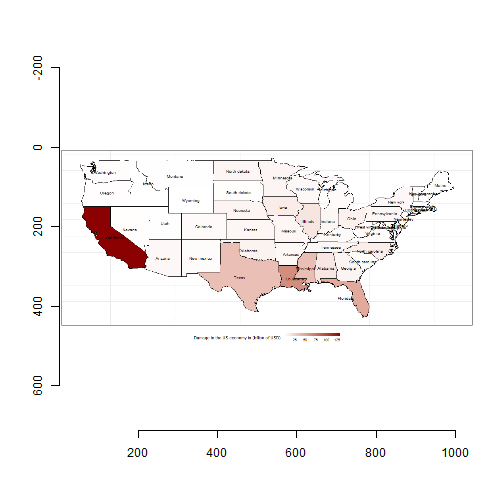

Damage to the US Economy Due to Weather Disasters
========================================================
author: Roberto Martinez de Morentin
date: 27/09/2019
autosize: true

Introduction
========================================================

Storms and other severe weather events can cause economic problems for communities and municipalities. Many severe events can result crop and property damage. This `shiny` application allow you to select a period of time, two type of economic damage and to see a map of the United States with the breakdown of the damage in billions of USD per state.


Variables
========================================================

We will use the next variables to quantify the damages:

Name of the variable      | Description
-----------------------   | -----------------
State                     | Name of the State (United States)
TotDmgCost                | Cost of the Total Damage in Billion of USD
PropDmgCost               | Cost of the Damage (Property) in Billion of USD
HarvDmgCost               | Cost of the Damage (Harvest) in Billion of USD


Documentation
========================================================

Dataset used for the study:


```
   EVTYPE FATALITIES INJURIES PROPDMG PROPDMGEXP CROPDMG CROPDMGEXP STATE
1 TORNADO          0       15    25.0          K       0               AL
2 TORNADO          0        0     2.5          K       0               AL
3 TORNADO          0        2    25.0          K       0               AL
4 TORNADO          0        2     2.5          K       0               AL
5 TORNADO          0        2     2.5          K       0               AL
6 TORNADO          0        6     2.5          K       0               AL
            BGN_DATE
1  4/18/1950 0:00:00
2  4/18/1950 0:00:00
3  2/20/1951 0:00:00
4   6/8/1951 0:00:00
5 11/15/1951 0:00:00
6 11/15/1951 0:00:00
```


Slide With Plot
=======================================================



References
========================================================

You can find below the references to the Storm Events Database [1-2] as well as the one for R[3] and shiny[4]: 

[1] Storm Data FAQ Page. Storm Events Database. National Climatic Data Center. 

[2] National Weather Service Instruction 10-1605 concerning Storm Data preparation.

[3] R Core Team, R: A Language and Environment for Statistical Computing. R Foundation for Statistical Computing. http://www.R-project.org/.

[4] RStudio. shiny: Easy web applications in R. http://shiny.rstudio.com

